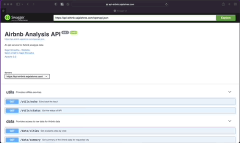

```{r setup, include=FALSE}
knitr::opts_chunk$set(echo = TRUE)
```

# Introduction

{width=60%}

Airbnb Analysis API is a service that allows everyone, including students, analysts, and developers, to quickly fetch the data and use it to perform some analysis. The API service provides multple endpoints such as utils, data, and analysis to extract important features of the dataset.

Application is live at: [api-airbnb.sajalshres.com](https://api-airbnb.sajalshres.com)

Source code is available at [Airbnb Analysis API](https://github.com/sajalshres/sta-518-project/tree/main/api)

## Requirements

Some of the important packages that I've used in the project are:

- [tidyverse](https://www.tidyverse.org/)
- [plumber](https://www.rplumber.io/articles/introduction.html)
- [jsonlite](https://github.com/jeroen/jsonlite)

## Content Organization

I believe that content organization is very critical when designing sophisticated application. To achieve this, I created somewhat scalable folder structure as below:

```
app
|--- modules      # Contains functions that can be reused in Application code
|--- routes       # Contains routes to multiple data endpoints such as utils, data
|--- app.R        # Main entrypoint to run plumber api server
|--- dockerfile   # Containerized environment to run app
```

## Deployment (CI/CD)

The deployment process is very similar to shiny app. I have first containerized the app using [Docker](https://docker.com). To build the app, the CI environment uses [dockerfile](https://github.com/sajalshres/sta-518-project/blob/main/api/dockerfile) and [docker-compose.yml](https://github.com/sajalshres/sta-518-project/blob/main/docker-compose.yml) file. The sample code to build is below:

```
# Build to docker image
$ docker-compose -f docker-compose.yml build api

# Push the docker image to remote registry
$ docker-compse push -f docker-compose.yml push api
```

The Digital Ocean service detects the newly built image and deploys it to docker.

For more details regarding the deployment process, please refer to [https://github.com/sajalshres/sta-518-project/blob/main/docs/docker.md](https://github.com/sajalshres/sta-518-project/blob/main/docs/docker.md)

Additional details regarding the project can be viewed at my [self-reflection](https://sajalshres.github.io/sta-518-portfolio/reflection.html) section in my portfolio and github source code.
