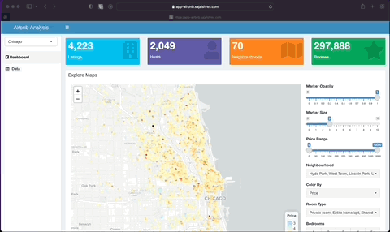

```{r setup, include=FALSE}
knitr::opts_chunk$set(echo = TRUE)
```

# Introduction

{width="60%"}

Airbnb analysis is a web application that provides an interactive dashboard containing visualizations and summaries to gain insights about Airbnb using the Airbnb dataset for the USA.

Application is live at: [app-airbnb.sajalshres.com](https://app-airbnb.sajalshres.com)

Source code is available at [Airbnb Analysis App](https://github.com/sajalshres/sta-518-project/tree/main/app)

## Requirements

Some of the important packages that I've used in the project are:

-   [tidyverse](https://www.tidyverse.org/)
-   [shiny](https://shiny.rstudio.com/articles/basics.html)
-   [shinydashboard](https://rstudio.github.io/shinydashboard/get_started.html)
-   [waiter](https://github.com/JohnCoene/waiter)
-   [leaflet](https://rstudio.github.io/leaflet/)
-   [DT](https://rstudio.github.io/DT/)

## Content Organization

I believe that content organization is very critical when designing sophisticated application. To achieve this, I created somewhat scalable folder structure as below:

    app
    |--- components   # Common components that can be used in UI
    |--- modules      # Contains functions that can be reused in Application code
    |--- views        # Contains page views such as dashboard page, data page etc.
    |--- app.R        # Main entrypoint to run shiny server
    |--- dockerfile   # Containerized environment to run app
    |--- global.R     # Run important logic when starting shiny server
    |--- server.R     # Contains all the server logic for shiny app
    |--- ui.R         # Combines all the UI components and views

## Deployment (CI/CD)

For deployment, I have first containerized the app using [Docker](https://docker.com). To build the app, the CI environment uses [dockerfile](https://github.com/sajalshres/sta-518-project/blob/main/app/dockerfile) and [docker-compose.yml](https://github.com/sajalshres/sta-518-project/blob/main/docker-compose.yml) file. The sample code to build is below:

    # Build to docker image
    $ docker-compose -f docker-compose.yml build app

    # Push the docker image to remote registry
    $ docker-compse push -f docker-compose.yml push app

The Digital Ocean service detects the newly built image and deploys it to docker.

For more details regarding the deployment process, please refer to <https://github.com/sajalshres/sta-518-project/blob/main/docs/docker.md>

Additional details regarding the project can be viewed at my [self-reflection](https://sajalshres.github.io/sta-518-portfolio/reflection.html) section in my portfolio and github source code.
