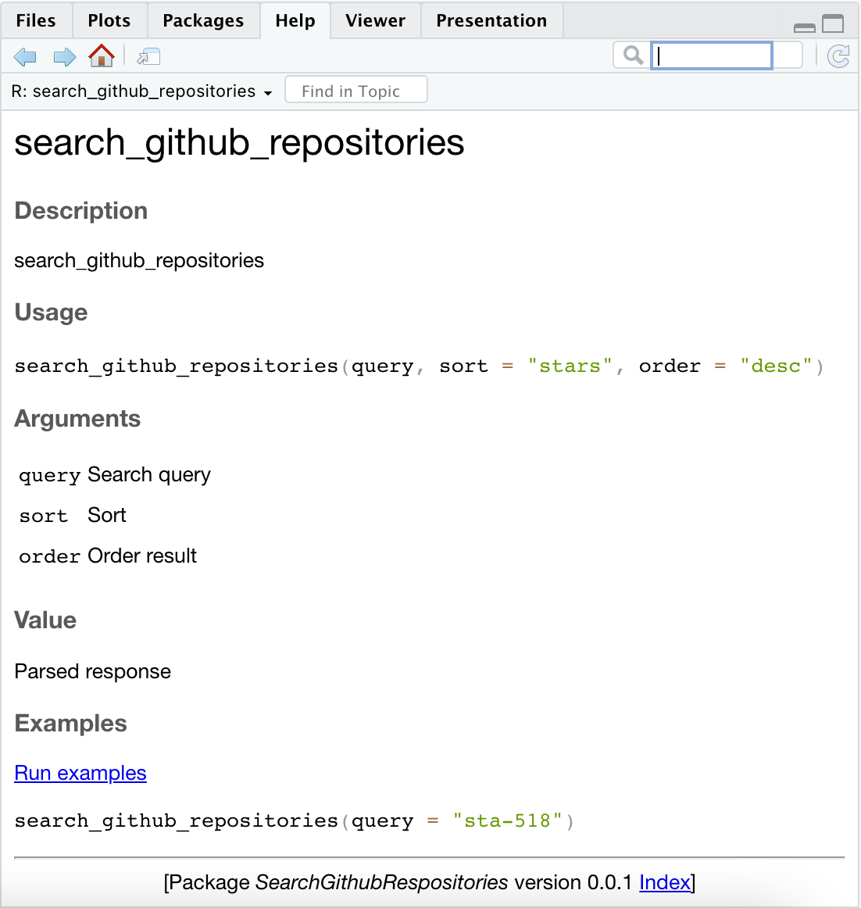

```{r setup, include=FALSE}
knitr::opts_chunk$set(echo = TRUE)
```

# Introduction

Packages are the awesome way of sharing and dsitributing R code that help us to extend the capabilities of R programs and collaborate with others. Throughout my journey to learn R, I've extensively used packages like `dplyr`, `tibble`, `ggplot2`, `boot` etc. I cannot imagine developing R code without support for packages as it made my life much easier and saved a lot of time. So, I wanted to create a custom package to learn how to create packages and install them.

I created a package SearchGithubRepository using the code from functions artifacts. 

The Github link to package is: [https://github.com/sajalshres/SearchGithubRespositories](https://github.com/sajalshres/SearchGithubRespositories)

## How to create a custom package

To create a custom package, I used `usethis::create_package` function to create a R package:

```
usethis::create_package("SearchGithubRespositories")
```

Next I created function for package using `usethis::use_r`:

```
usethis::use_r("search_github_repositories")
```

The `use_r` function creates a file based function inside `/R` folder.

After creating required functions, I added `DESCRIPTION` file that providdes the summary of the package such as title, version, author etc.

Then, I create documentation for each of the functions that I've added inside `/R` folder. An example for `version` function is:

```
#' version
#'
#' @return A message
#' @export
#'
#' @examples version()
```

Lastly, I used `check` function to see everything was working as expected and then installed my package using `install` function.

## Demonstration

### Load Libraries

I've installed and used `devtools` library to install custom package as it is not published yet.

```{r extend-r-load-package}
library(devtools)
```

### Load my custom package

I've used `install_github` function to install the  `SearchGithubRespositories` package.

```{r extend-r-load-custom-package}
install_github("sajalshres/SearchGithubRespositories")
```

### Sample usage

Below is the demonstration of the usage of the package:

```{r extend-r-custom-package-usage}
SearchGithubRespositories::version()
```

```{r extend-r-custom-package-usage-2}
response <- SearchGithubRespositories::search_github_repositories(query = "sta-518")
response$total_count
```

### View help text

Similarly, we can view the help documentation using `?` operator.

```{r extend-r-custom-package-usage-3}
?SearchGithubRespositories::search_github_repositories
```

{width=50%}

